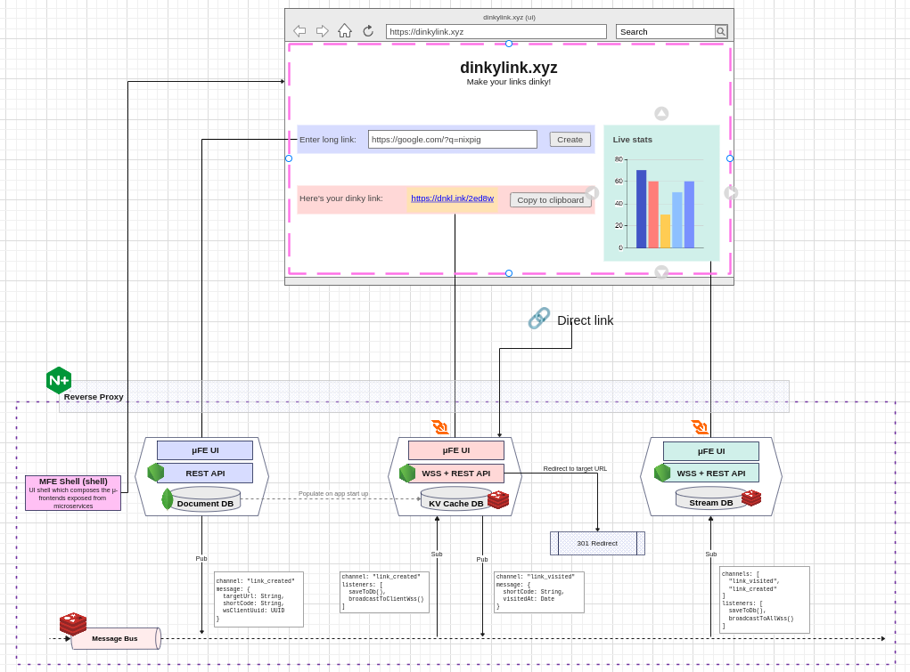

# dinkylink

## Overview

I wanted to have a play around with a couple of features of Redis - caching, pub/sub and streams.

Obviously, this is a pretty convoluted set up for such a simple app, but allowed to touch on the Redis features mentioned.

